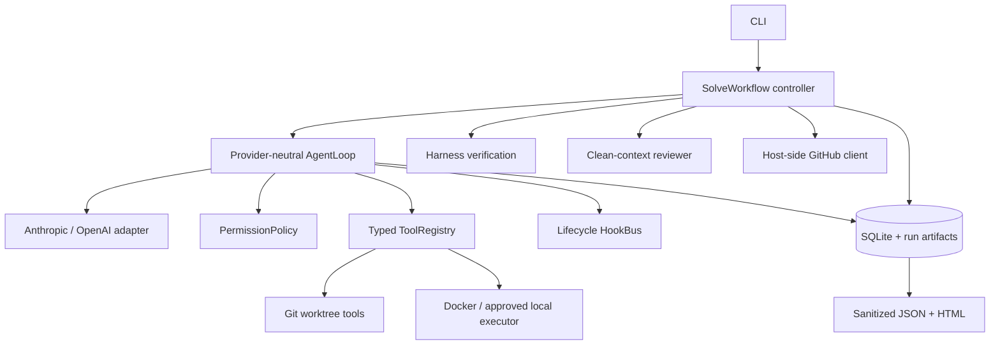

# Architecture

## Design thesis

An SWE agent is a control system around a probabilistic planner. The model should retain agency
over exploration and implementation, while deterministic code enforces invariants that must hold
across providers, prompts, crashes, and retries.

| Model-owned | Harness-owned |
| --- | --- |
| What to inspect, hypothesis formation, patch content, when work seems ready | State transitions, tool validation, path confinement, isolation, verification, budgets, checkpoints, approvals, publication idempotency |

## Components

### Normalized protocol

`ModelBackend.complete()` accepts normalized `Message` and `ToolSpec` values and returns a
`ModelResponse`. Messages contain typed `TextPart`, `ToolCallPart`, or `ToolResultPart` values.
Adapters perform wire conversion at the boundary, so provider stop reasons and SDK object shapes
cannot control core semantics.

The loop continues when actual tool calls exist, regardless of stop reason. Every call receives a
result: success, handler failure, validation failure, denial, pending approval, unknown tool, or a
recovered idempotent result.

### Lifecycle handshake

The planning registry exposes `submit_plan`; using it advances the controller to implementation.
The implementation registry exposes `finish_task`; using it requests verification but cannot mark
verification as passed. Verification runs configured argv commands through the selected executor.
A failed check returns evidence to the main Agent for at most two repair attempts.

On success, a new reviewer conversation receives issue metadata, bounded diff, and verification
evidence with read/review-only tools. A `request_changes` verdict can cause one repair round. This
provides an independent check without the coordination cost of a persistent multi-agent team.

### Persistence and recovery

`.gha/state.db` stores runs, append-only events, per-actor checkpoints, tasks, approvals, tool-call
results, and memories. `.gha/runs/<run-id>/` stores reports and bounded artifacts. The worktree is
the durable code snapshot.

Resume reconstructs the controller from phase, workflow counters, normalized messages, and
worktree metadata. Completed tool results are reused by `(run_id, call_id)`. Publication is also
idempotent by head branch plus `<!-- gh-assistant:<run-id> -->`.

### Middleware, context, and memory

Lifecycle hooks fire before/after model and tool calls, plus errors and stops. Policy, budgeting,
compaction, tracing, and cost accounting can evolve here without provider branches in the loop.

Skills load lazily from trusted packaged and untrusted repository directories. Repository skills
add context, never authority. Memory includes provenance and source hashes; stale repo-file memory
is not silently reused, and issue text cannot automatically become durable memory.

Compaction operates on normalized messages, preserves tool-call/result pairing, moves large tool
output to artifacts, and has one reactive context-overflow recovery path.

## Publication transaction

1. Harness computes the snapshot and commits with Git hooks disabled.
2. Approval binds to commit SHA plus diff hash.
3. Resume recomputes the subject; changed code cannot reuse approval.
4. An approved transaction pushes through a temporary askpass helper.
5. The host GitHub client finds or creates the Draft PR idempotently.
6. Tokens never enter model context, Docker, approval payloads, or reports.

This is not a distributed transaction, but the idempotency keys make crash recovery converge
without duplicate pushes, comments, or PRs.

## Deliberate omissions

- No automatic merge or issue close: those are irreversible repository decisions.
- No automatic deletion of changed worktrees: recovery evidence is more valuable than cleanup.
- No cron: unattended scheduling widens authority without improving harness semantics.
- No permanent three-agent team: only the reviewer has a justified context-isolation role.
- No mandatory MCP layer: typed tools are stable; MCP can be an adapter later.
