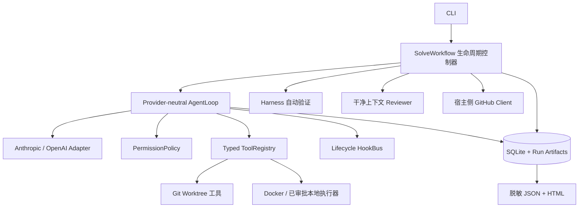

# 架构设计

## 设计主张

SWE Agent 本质上是围绕概率型规划器构建的控制系统。模型应保留对代码探索、问题判断和实现方式
的自主权；无论使用哪个模型、Prompt 如何变化、进程是否崩溃，关键不变量都必须由确定性的
Harness 保证。

核心循环受 [mini-swe-agent](https://github.com/11zhangzheng/mini-swe-agent) 启发：保持 Model 与
Tool 接口小而明确，以线性消息历史记录轨迹，并让每个动作独立执行。`gh-assistant` 没有照搬单一
shell 工具，因为本项目还需要展示 typed tools、权限 fail closed、worktree/Docker 隔离、持久化
恢复、独立 Reviewer 与发布幂等；这些是面向真实 GitHub 写操作时不能交给 Prompt 保证的边界。

| 模型负责 | Harness 负责 |
| --- | --- |
| 阅读哪些文件、建立假设、选择修复方案、生成补丁、判断何时可以交付 | 状态迁移、工具校验、路径约束、执行隔离、自动验证、预算、checkpoint、审批和发布幂等 |

## 总体架构



## 统一消息协议

`ModelBackend.complete()` 接收内部 `Message` 和 `ToolSpec`，返回 `ModelResponse`。消息由以下
类型组成：

- `TextPart`：普通模型文本。
- `ToolCallPart`：带唯一 ID、工具名和结构化参数的调用。
- `ToolResultPart`：与调用 ID 配对的成功、失败、拒绝或恢复结果。

Anthropic 与 OpenAI-compatible Adapter 只在边界进行格式转换，Provider SDK 对象不会进入核心
循环。因此核心循环不会依赖某家模型的响应类、tool call 表示或 stop reason。

循环根据实际存在的 Tool Call 决定是否继续。每次 Tool Call 都必须获得结果；未知工具、参数错误、
权限拒绝和 handler 异常全部 fail closed，不能让对话中出现悬空调用。

## 生命周期与模型握手

完整生命周期为：

```text
intake -> planning -> implementation -> verification -> review
       -> repair / publish -> done
```

- Planning 阶段暴露 `submit_plan`，模型提交有效计划后才能进入实现。
- Implementation 阶段暴露 `finish_task`，它只表示模型请求 Harness 验证。
- Verification 由 Harness 执行配置中的 argv 命令，模型不能自行声明测试通过。
- 测试失败会把真实命令、退出码和输出交回主 Agent，最多允许两轮修复。
- 测试通过后创建全新的 Reviewer 上下文，只提供 Issue、diff 和测试证据。
- Reviewer 只有读取与提交审查结论的工具，最多触发一轮返工。

这种拓扑只在确实需要上下文独立性时引入第二个 Agent，避免常驻团队带来的消息路由、所有权和
一致性复杂度。

## 状态持久化与恢复

`.gha/state.db` 保存：

- Run 生命周期、分支、base SHA 与 worktree 路径。
- Append-only events 和关联 ID。
- 主 Agent 与 Reviewer 各自的 normalized message checkpoint。
- 结构化计划、审批、Tool Call 结果和 memory。

`.gha/runs/<run-id>/` 保存报告和被截断前的大型工具输出。Git worktree 本身则是代码状态的持久化
快照。

`gha resume` 根据持久化 phase、workflow counters、checkpoint 和 worktree 元数据恢复控制器。
已完成工具调用通过 `(run_id, call_id)` 复用结果，不会重复执行。外部发布再通过 head branch 和
`<!-- gh-assistant:<run-id> -->` marker 实现幂等。

## Middleware 与 Hook

Agent Loop 在模型调用、工具调用、异常和停止前后触发生命周期 Hook。追踪、成本、预算、权限和
上下文压缩可以挂载在这里，而不需要向核心循环加入 Provider-specific 分支。

## Skills、Memory 与上下文压缩

Skills 从两个来源按需发现：

- 随包发布的 Skills：可信 Harness 指导。
- 仓库中的 Skills：不可信上下文，只能提供建议，不能修改权限。

Memory 记录来源、内容哈希和状态。仓库文件变化后，过期 memory 不会被静默使用；Issue 和评论
不能自动晋升为长期记忆。

压缩只处理内部消息类型，并保持 Tool Call 与 Tool Result 成对。长输出会先落盘再替换为摘要；
当 Provider 报告 context overflow 时，只允许一次响应式恢复，随后显式失败并保留 checkpoint。

## 发布事务

1. Harness 计算 diff snapshot，并在禁用 Git hooks 的情况下创建提交。
2. 发布审批绑定 commit SHA 与 diff hash。
3. Resume 时重新计算 subject，代码变化后不能复用旧审批。
4. 审批通过后使用临时 askpass helper push branch。
5. 宿主侧 GitHub Client 查找或幂等创建 Draft PR。
6. Token 不会进入模型上下文、Docker、审批载荷或报告。

它不是严格的分布式事务，但依靠稳定幂等键，可以让崩溃恢复最终收敛，不重复 push、comment 或
创建 PR。

## 有意不做的事情

- 不自动 merge 或关闭 Issue。
- 不自动删除包含修改的 worktree。
- MVP 不运行 cron 或无人值守扫描。
- 不维护常驻三 Agent 团队。
- 不把 MCP 设为核心依赖；未来可作为 Tool Adapter 接入。
