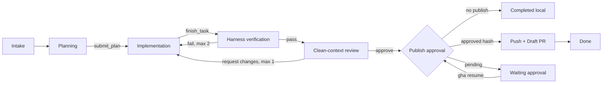

# gh-assistant

An auditable GitHub software-engineering agent harness. It accepts an issue, creates an
isolated Git worktree, lets a model inspect and patch the repository, runs harness-owned
verification, asks a clean-context reviewer to inspect the evidence, and requests approval
before pushing a branch and creating a Draft PR.

The project is deliberately about the **harness**, not a large cast of agents. The model owns
judgment and tool selection. The harness owns lifecycle constraints, normalized messages,
permissions, isolation, budgets, checkpoints, recovery, evaluation, and observability.

[Chinese](README.zh-CN.md) | [Architecture](DESIGN.md) | [Security](SECURITY.md) | [Evaluation](EVALUATION.md)

## What it demonstrates

- A provider-neutral `Message / TextPart / ToolCall / ToolResult` protocol with Anthropic and
  OpenAI-compatible adapters. Provider SDK objects never enter the core loop.
- A fixed, persisted lifecycle: `intake -> planning -> implementation -> verification -> review
  -> repair/publish -> done`.
- One run, branch, and worktree per issue. The user's checkout is never modified.
- Docker-first command execution with no network, a read-only container root, a single worktree
  mount, dropped capabilities, and CPU/memory/process/time limits.
- Explicit approval before local execution when Docker is unavailable. Non-interactive runs pause
  as `waiting_approval`; they never silently downgrade.
- A clean-context, read-only reviewer that receives only the issue, diff, and test evidence, with
  at most one review repair round.
- SQLite checkpoints and idempotent tool calls, pushes, and Draft PR creation.
- Hash-bound publish approval. Any commit or diff change invalidates prior approval.
- Sanitized JSON and self-contained HTML reports with phase, tool, approval, verification,
  review, retry, token, and optional cost evidence.
- A deterministic eight-case Python benchmark and `baseline`/`full` harness comparison.

## Lifecycle



`finish_task` does not mean "tests passed." It only hands control back to the harness, which runs
configured verification itself. Unknown tools, exceptions, invalid paths, and unknown permissions
fail closed.

## Quick start

Python 3.11+ is required.

```bash
python -m venv .venv
. .venv/bin/activate                 # Windows: .venv\Scripts\activate
python -m pip install -e ".[dev]"
cp .env.example .env

gha doctor
gha solve OWNER/REPO 123 --path /path/to/checkout --no-publish
gha runs
gha report RUN_ID
```

Build the bundled Python runner before Docker-backed solving:

```bash
docker build -t gh-assistant-python:3.12 docker
```

The source checkout can also be invoked without installation:

```bash
python -m gh_assistant --state-dir .gha runs
```

## CLI

| Command | Purpose |
| --- | --- |
| `gha doctor [--repo OWNER/REPO]` | Check Python, Git, Docker, model, GitHub, and state storage |
| `gha triage OWNER/REPO` | Read and classify open issues; GitHub writes require approval |
| `gha solve OWNER/REPO ISSUE --path PATH` | Start an isolated repair run |
| `gha resume RUN_ID` | Resume from a checkpoint or pending approval |
| `gha runs` | List persisted runs |
| `gha approvals [approve|deny]` | Inspect or decide approvals |
| `gha report RUN_ID` | Generate sanitized JSON and standalone HTML reports |
| `gha eval MANIFEST --profile baseline|full` | Run deterministic fixture evaluation |

Important defaults: 30 main-agent turns, 120 tool calls, two verification repairs, and one reviewer
repair. Exhaustion preserves the worktree and transitions to `needs_human`.

## Configuration

Host configuration comes from environment variables. Repository configuration is untrusted and
may provide only verification commands and skill/include/exclude hints:

```yaml
version: 1
verify:
  - ["python", "-m", "pytest", "-q"]
skills: ["python-testing"]
```

Repository configuration cannot grant permissions, select local execution, provide credentials,
or enable publishing. Other languages can be supported through a trusted host-selected image and
argv verification commands.

## Verification

The test suite uses scripted models, temporary Git repositories, and fake GitHub transports. It
does not consume model credits or write to GitHub.

```bash
python -m coverage run --branch -m pytest -q
python -m coverage report --fail-under=85
```

Current local result: **58 passed, 2 skipped, 86% branch coverage**. The skips are the Docker
integration test (daemon unavailable) and the symlink escape test (Windows symlink privilege
unavailable); neither is reported as passing.

## Scope choices

The MVP intentionally excludes automatic merge, issue closing, worktree deletion, cron, and a
persistent three-agent team. Those features expand irreversible effects and coordination state
without improving the central demonstration: a recoverable, policy-controlled SWE agent harness.
MCP is also not required for the core architecture; host integrations can be added behind the same
typed `Tool` contract.

## Project layout

```text
gh_assistant/       provider adapters, loop, policy, tools, state, workflow, reports
gh_assistant/skills packaged trusted skills
docker/             constrained Python runner image
benchmarks/         eight deterministic fixture issues
tests/              unit, integration, recovery, safety, report, and benchmark tests
```

The earlier learning modules under `core/`, `context/`, `memory/`, `skills/`, and `github/` remain
in the repository as provenance. The production implementation lives in `gh_assistant/`.
